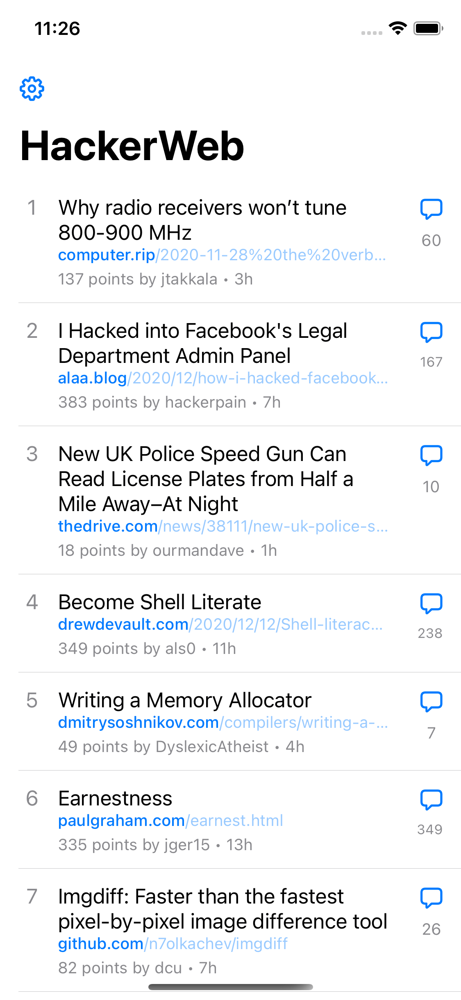
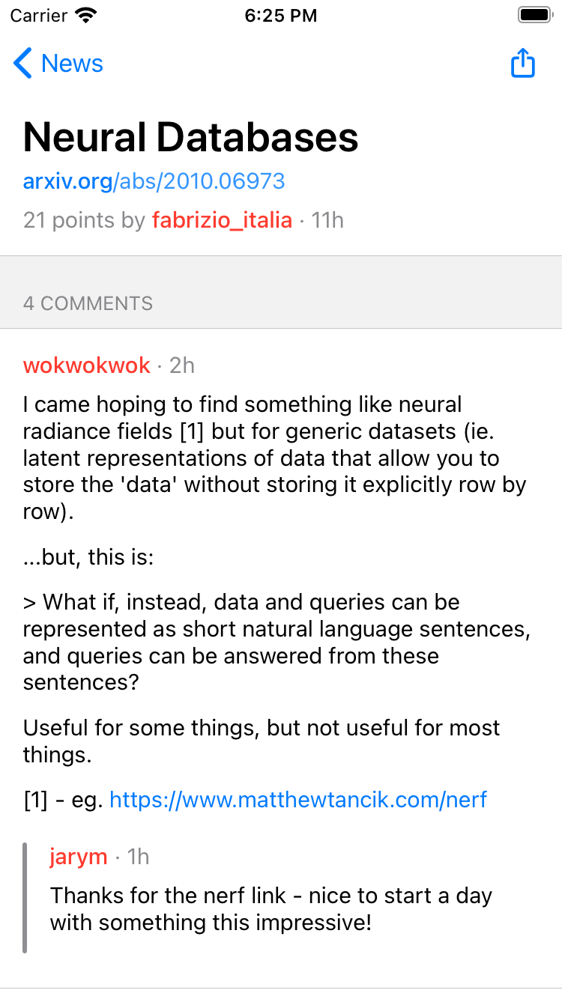
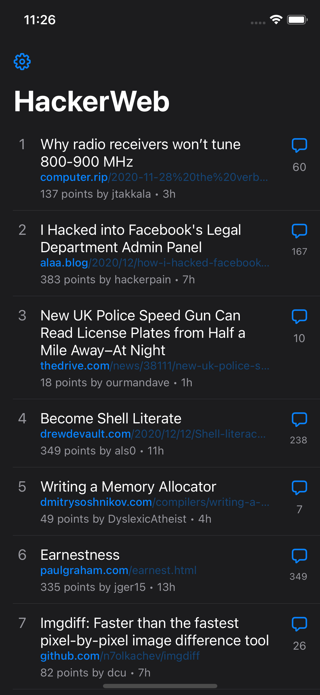
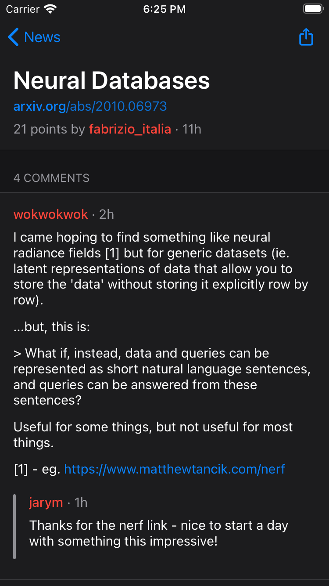

# HackerWeb 2

> A read-only Hacker News client.

- Only 30 front-page stories. No more no less.
- Revolutionary comments thread UI. Smart collapse and easy navigation.
- Easy-switch between web view and comments view.

This is a complete rewrite of the first version launched in 2016.

- V1: https://github.com/cheeaun/hackerweb-native
- Story: http://cheeaun.com/blog/2016/03/building-hackerweb-ios/

## Preview

### Light

 

### Dark

 

## Development

This is built with [Expo](https://expo.io/) under the **Managed Workflow**. Currently using **SDK 40** and **targeted only for iOS** (for now).

```
npm install -g expo-cli
```

After cloning this repository:

```
cd hackerweb-native-2
npm i
npm start
```

## Resources

- API from [node-hnapi](https://github.com/cheeaun/node-hnapi) and [the official API](https://github.com/HackerNews/API)
- Icons from [SF Symbols](https://developer.apple.com/sf-symbols/)
- [Awesome Hacker News](https://github.com/cheeaun/awesome-hacker-news)

## License

- [MIT](http://cheeaun.mit-license.org/).
- Not affiliated with Hacker News or YCombinator.
